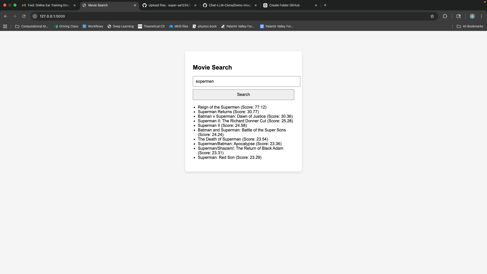
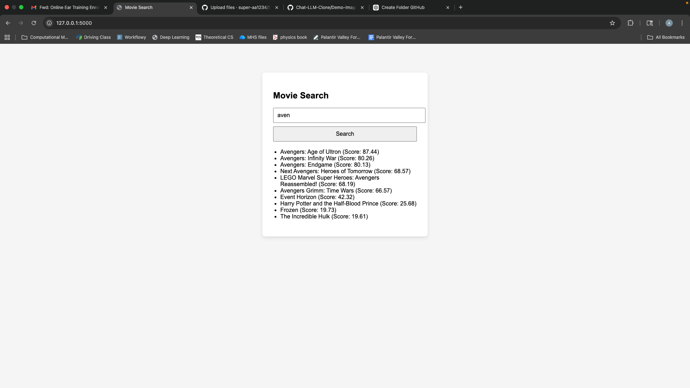

# Movie Search Engine

A movie search engine built with Flask that combines information retrieval techniques with ranking algorithms to deliver relevant search results.

## Live Demo

## Spell Correction


## Autocomplete


## Features
- **Inverted Index**: Fast O(1) lookup of movies by keywords using an inverted index data structure
- **Tree**: Precomputed Tree of words allows fast autocomplete and spell check of words. 
- **TF-IDF Scoring**: Relevance ranking using Term Frequency-Inverse Document Frequency algorithm
- **Tree-based Autocomplete**: Efficient prefix-based suggestions as users type
- **Spell Correction**: Intelligent typo correction using modified DFS on tree with edit distance constraints (up to 3 edits)
- **JSON Caching**: Inverted index and tree are cached to JSON for fast reloads
- **Flask Frontend**: Minimal but effective UI for search and results.

### Algorithm:
1. Splits query into tokens
2. Uses inverted-index to find relevant results for each token
3. If tokens not in inverted-index uses spell-check and autocomplete to find matches
4. Ranks based on TF-IDF and 10x weight for token in title vs description
5. Takes top 20 candidates
4. Normalizes all factors(rating, popularity, etc.) to 0-100 scale and does weighted average.
5. Takes final top 10 in ranked order.

### Spell Correction Algorithm
The spell correction uses a modified DFS on the tree that tracks edit distance:
- **Substitution**: Replace character (distance: 1)
- **Deletion**: Remove character (distance: 1)
- **Insertion**: Add character (distance: 1)
It goes through the misspelled word character by character and at each stage explores all of the following edits recursively. It automatically prunes branches with edit distance more than a specified threshold, and returns potential spell corrections from the inverted index.

### Weighting
Results are ranked based on a weighted combination of factors:
- **70% Relevance**: TF-IDF score with 10x boost for title matches vs description matches
- **10% Popularity**: Trending score from The Movie Database (TMDb)
- **10% Rating**: User review scores (0-10 scale)
- **10 Budget**: Production budget (indicates major studio releases)


### Installation & Setup

## Prerequisites
- Python 3.7+
- pip


1. Clone the repository
```bash
git clone <repository-url>
cd searchEngineApp
```

2. Install dependencies
```bash
pip install flask
```

3. Run the application
```bash
flask --app app run --debug
```

Visit `http://localhost:5000` in your browser.


